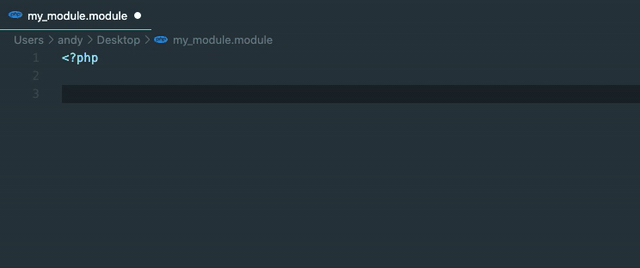
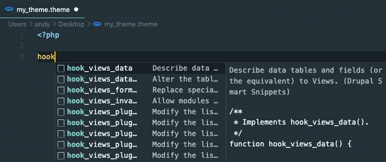

# Visual Studio Code Smart Drupal Snippets

This extension adds rich language support for the
[Drupal 8.9.x Hooks API](https://api.drupal.org/api/drupal/core%21core.api.php/group/hooks/8.9.x)
to VS Code. This extension is intended as a successor to
[Drupal 8 Snippets](https://marketplace.visualstudio.com/items?itemName=dssiqueira.drupal-8-snippets).

# Usage & Features
Type part of a snippet, press enter and/Or tab, and the snippet unfolds.

## Built from Drupal 8.9.x API
Hooks gathered by scraping the offical
[Drupal documentation](https://api.drupal.org/api/drupal/core%21core.api.php/group/hooks/8.9.x).
This includes those that are marked as deprecated

## Smart hook replacement
Snippets will automatically replace the leading `hook` with the current file's name.

## Tab Stops
Snippets are formatted to have tab stops on values that need replaced like `HOOK`,
`ENTITY_TYPE`, `BASE_FORM_ID`, etc.

# Installation

1. Open VS Code
2. From the command palette `Ctrl-Shift-P` (Windows, Linux) or `Cmd-Shift-P` (OSX)
3. Select Install Extension
4. Search by `Drupal Smart Snippets`
5. Click install
6. Reload Visual Studio Code

# Contributions
This project is maintained on
[Github](https://github.com/andy-blum/smart-drupal-snippets).

Your bugs, feature requests, and pull requests are welcome.