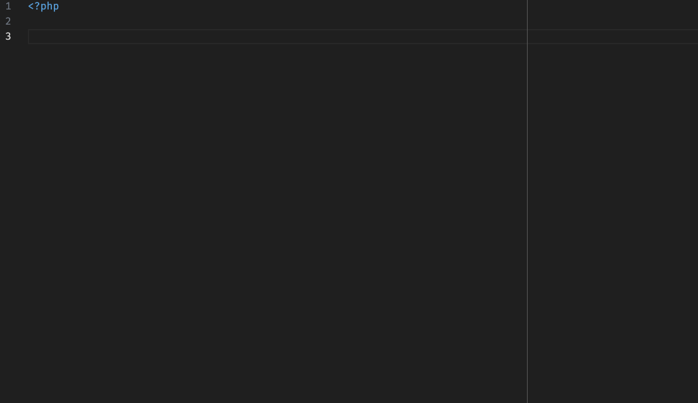
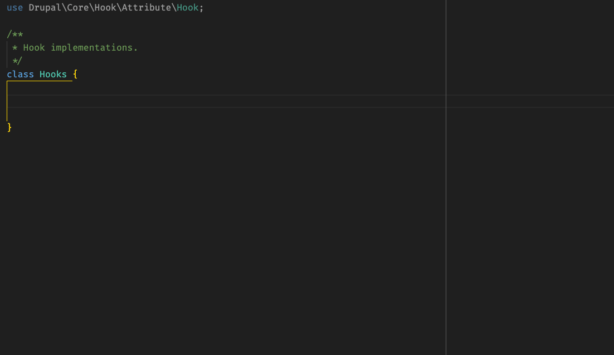

# Drupal Smart Snippets

This extension provides context-aware, real-time IntelliSense for Drupal development. Unlike static snippet libraries, it dynamically scans your workspace to provide accurate completions based on your specific project's Drupal core verion, as well as contrib and custom code.

## Key Features
- **Dynamic Indexing**: Scans `*.api.php`, `*.services.yml`, and `Element` classes across your entire project.
- **Broad Version Support**: Compatible with **Drupal 8, 9, 10, and 11+**. Since the extension reads your actual codebase, it automatically adapts to the API of whatever version you are running.
- **Real-time Updates**: Automatically detects and indexes new hooks or services as you add them to your codebase—no reload required.
- **Drupal 11+ Ready**: Full support for both procedural hooks and modern OOP-style hook implementations.
- **High Priority**: Drupal-specific completions are prioritized at the top of your IntelliSense list.

## Hooks

The extension fully supports both traditional procedural hooks as well as the modern [OOP hook implementation pattern introduced in Drupal 11.1](https://www.drupal.org/node/3442349). When working within a `src/Hook` directory, the extension automatically adapts its snippets:

- **Smart Casing**: Automatically converts `snake_case` hook names into proper `camelCase` method names (e.g., `hook_preprocess_block` becomes `preprocessBlock`).
- **Attribute Generation**: Generates the required `#[Hook]` attribute alongside the method signature.
- **Dynamic Placeholder Sync**: When implementing a hook with placeholders (like `hook_preprocess_HOOK`), typing the specific hook name in the attribute will automatically update and correctly case the method name in real-time.

<details>
  <summary>Examples</summary>

  ### Procedural Hooks
  

  ### Object-oriented Hooks
  
</details>

## Services
Accessing Drupal services via `\Drupal::service()` often loses IDE type-hinting. This extension provides easy access to core and contrib services with proper data typing.

- **Universal Support**: Works in both procedural `.module` files and OOP classes.
- **DI Recommendation**: In OOP contexts (within `/src/`), snippets include a `@todo` suggestion to use proper Dependency Injection instead of the service locator pattern.
- **Typed Variables**: Uses PHP `assert()` statements to provide IDE type-hinting based on the service's defined class.

## Render & Form Elements
Quickly scaffold Drupal render arrays by typing the element name (e.g., `element: textfield`).

- **Context-Aware Discovery**: Scans for classes using modern PHP Attributes (`#[FormElement]`) or legacy DocBlock Annotations (`@FormElement`).
- **Automatic Property Mapping**: Scans the element's class docblock to provide default tab-stops for common and specific properties.

## Recommended Settings

To ensure you get the best experience and avoid duplicate hook completions from general PHP extensions like Intelephense, we recommend adding the following to your VS Code `settings.json`:

```json
{
  "intelephense.files.exclude": [
    "**/*.api.php"
  ]
}
```

### Why this is recommended:
Extensions like PHP Intelephense provide their own hook completions by scanning `*.api.php` files. However, those completions often lack the smart casing, placeholder tab-stops, and modern Drupal support provided by this extension. By excluding these files from Intelephense, you ensure that **Drupal Smart Snippets** remains your primary source for Drupal IntelliSense.

## Contributions
This project is maintained on [Github](https://github.com/andrewdavidblum/smart-drupal-snippets).
Your bugs, feature requests, and pull requests are welcome.
