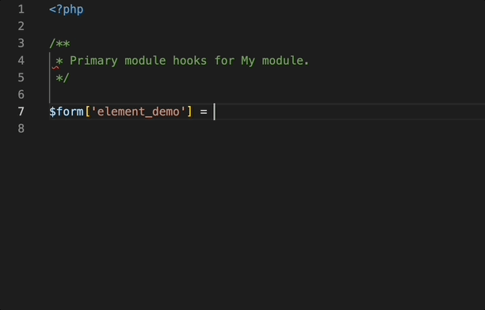
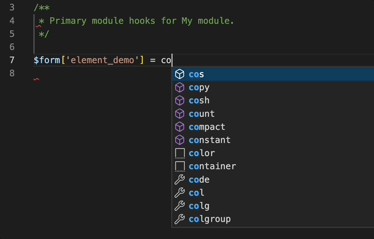

# Visual Studio Code Smart Drupal Snippets

This extension adds rich language support for the
[Drupal Hooks API](https://api.drupal.org/api/drupal/core%21core.api.php/group/hooks) and [Drupal Form and render elements](https://api.drupal.org/api/drupal/elements)
to VS Code. This extension is intended as a successor to
[Drupal 8 Snippets](https://marketplace.visualstudio.com/items?itemName=dssiqueira.drupal-8-snippets).

# Usage & Features
Type part of a snippet, press enter and/Or tab, and the snippet unfolds.

## Built from Drupal Core
Hooks gathered by scraping the codebase of the latest minor versions of Drupal 9. This includes those that are marked as deprecated.

## Smart hook replacement
Snippets will automatically replace the leading `hook` with the current file's name.

## Smart element replacement
Snippets will automatically render the element array base on RenderElement or FormElement. Start by typing '@RenderElement', '@FormElement' or the [type_name] itself.

FormElement will have `#title`, `#title_display`, `#description` and `#required` properties by default. Additional properties listed on docblock is generated automatically.

### @FormElement

### @RenderElement

### Typing [type_name]

## Tab Stops
Snippets are formatted to have tab stops on values that need replaced like `HOOK`,
`ENTITY_TYPE`, `BASE_FORM_ID`, etc.

### Hook Replacement

### Element Replacement
Element snippets have $form[`key`] as final tab stop. FormElement have `#title`, `#title_display` ([providing default options](https://www.drupal.org/docs/drupal-apis/form-api/form-render-elements)), `#description` and `#required`.

## Core Versions & Deprecation Warnings
Hook descriptions begin with the lowest version of core in which the hook is found.
Additionally, hooks that have been deprecated are labelled as such in the hook's
description and have an inline comment of `//deprecated` following the closing of
the function.

# Installation

1. Open VS Code
2. From the command palette `Ctrl-Shift-P` (Windows, Linux) or `Cmd-Shift-P` (OSX)
3. Select Install Extension
4. Search by `Drupal Smart Snippets`
5. Click install
6. Reload Visual Studio Code

# Contributions
This project is maintained on
[Github](https://github.com/andy-blum/smart-drupal-snippets).

Your bugs, feature requests, and pull requests are welcome.
